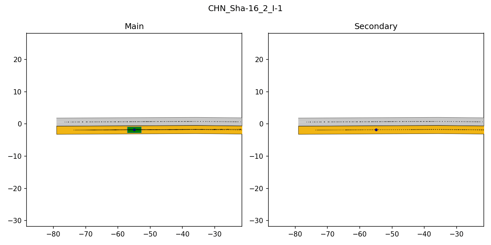
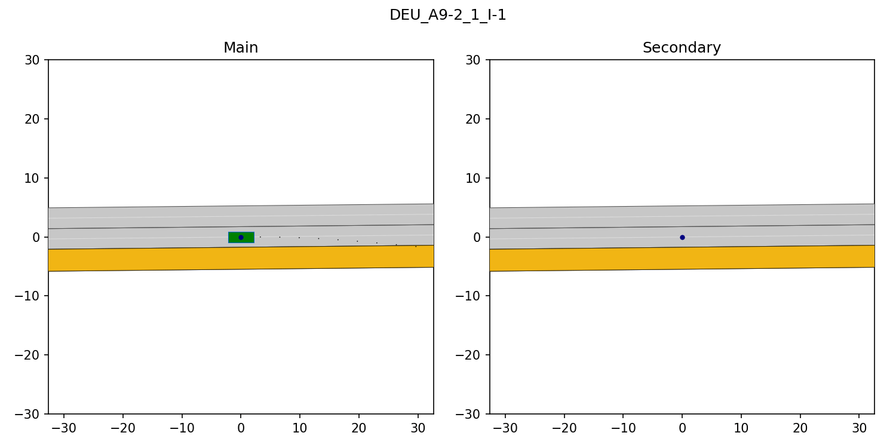
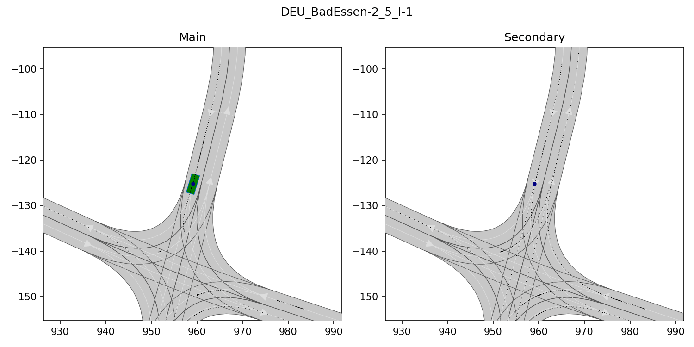
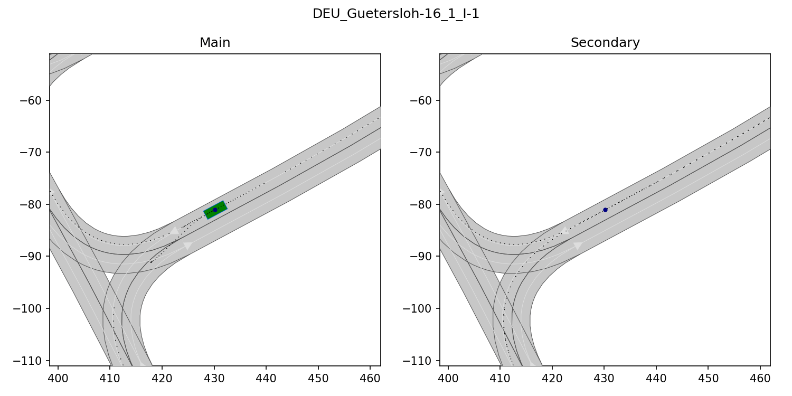
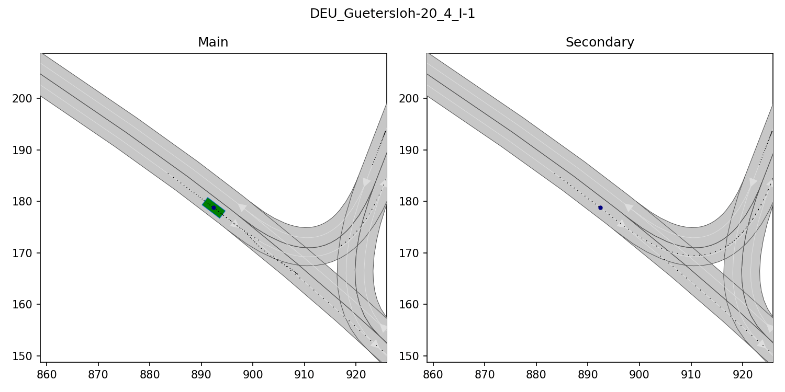
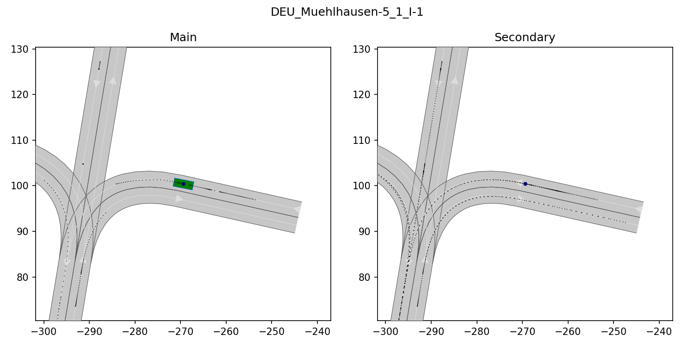
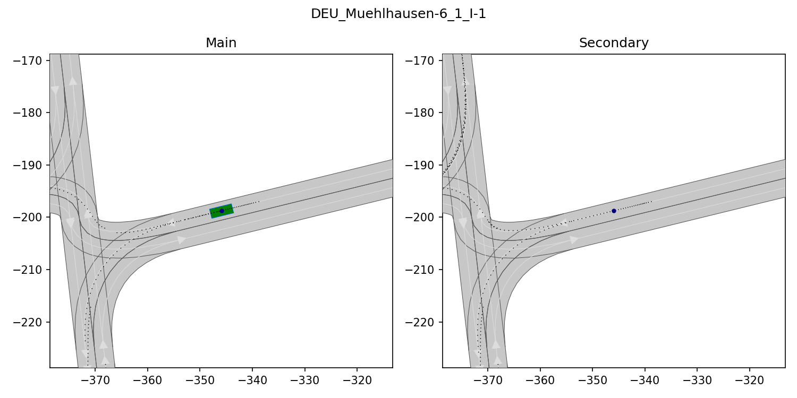
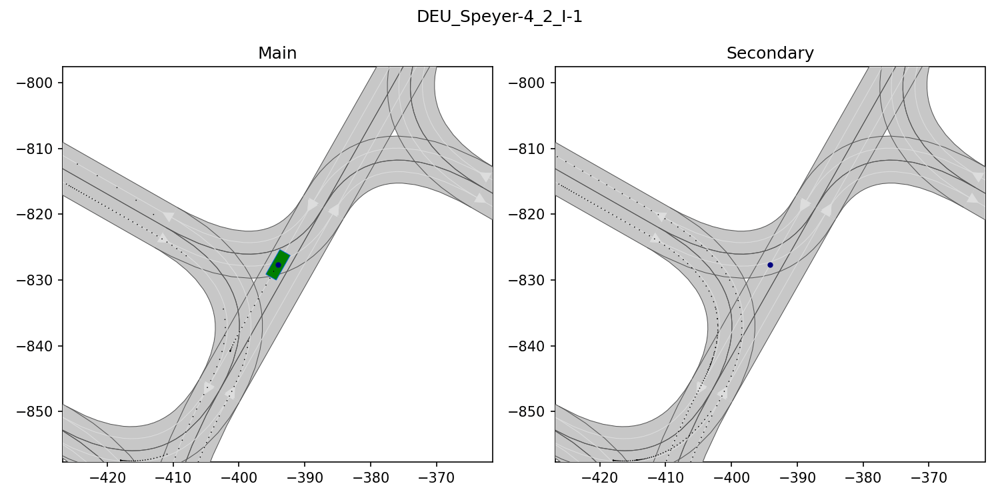
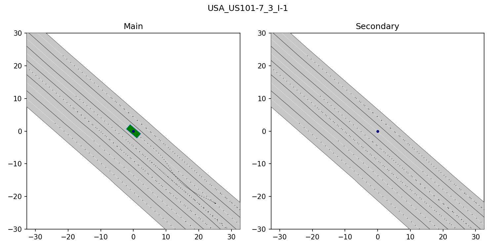
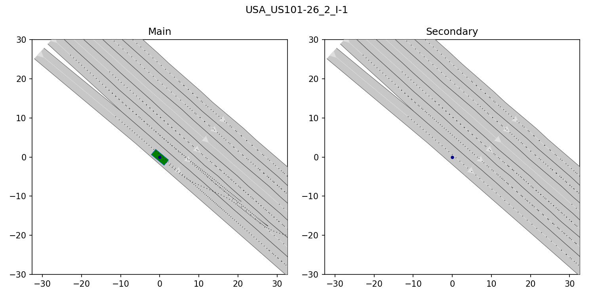

# Commonroad Interactive Benchmarks


Extend the existing non-interactive CommonRoad scenario generation methods to interative scenarios.

## Dependencies
*  The previous work [Commonroad_Scenarios](https://gitlab.lrz.de/ss19/commonroad_scenarios)
*  [SUMO-CommonRoad Interface](https://gitlab.lrz.de/cps/sumo-interface/-/tree/interactive_SS20)
*  [commonroad-sumo-manager](https://gitlab.lrz.de/cps/commonroad-sumo-manager), if needed.
*  [Anaconda](https://docs.anaconda.com/anaconda/install/)

## Installation

This project uses conda. Make sure it is installed before proceeding with the installation.

You can use your environment with python version 3.7, or create a new one by running
```bash
conda create -n cr37 python=3.7
```

**To install the dependencies of the module**, simply run
```bash
bash install.sh -e cr37
```

If you don't want to enter your git credentials many times, cou can configure `git` to save it automatically:
```bash
git config --global credential.helper store
```

This will create an `install` folder, pull all the dependencies and install them there

**Note:** `cr37` needs to be replaced by the name of your conda environment if needed.

## Usage

### Generate interactive CommonRoad scenarios using SUMO
To generate interactive scenarios use the script `scenario_generator/generate_scenarios.py`. 

```bash
python scenario_generator.generate_scenarios.py 
```
**Arguments:**
* `--cr_maps`: Path to the folder which contains the CommonRoad scenarios, which maps will be used for the scenarios generation. 
**Note:** *Currently only the files in this folder will be gathered, no recursive search is implemented.* 
**Default:** `/example_scenarios/maps/test`
* `--output`: Path to the output folder
**Default:** `/example_scenarios/output`
* `--video`: Flag, indicates whether video should be created or not
**Default:** `False`
* `--num_max_resimulation`: Sets the maximum number of resimulation
**Default:** `10`


This script will generate interactive scenarios as follows:
1. Read the CommonRoad scenarios from the passed folder and keep their lanelet network
2. Generate artificial traffic using SUMO
3. Search for interesting vehicles to be marked as ego, e.g. lane changing, strong breaking, etc.
4. If no appropriate vehicle has been found, repeat from 2. (but maximum 10 times), otherwise create planning problem from the chosen vehicle

## Determinism checker
Checking whether a scenario is deterministic or not by two means:
*  Simulate the scenario multiple times, compare the simulated scenarios.
*  Read rou.xml file and check if any key parameters are set to 'random'. 

To check interactive scenarios use the script `scenario_generator/generate_scenarios.py`. 

```bash
python determinism_checker.check_determinism.py 
```
**Arguments:**
* `--scenario_folder_path`: Path to the folder which contains the files of the interactive CommonRoad scenario, which will be checked. 
**Note:** *This script checks the determinism of only one scenario* 
**Default:** `Scenarios/CHN_Cho-1-1/CHN_Cho-1_1_I`
* `--output_folder_path`: Path to the output folder
**Default:** `/example_scenarios/output`
* `--video`: Flag, indicates whether video should be created or not
**Default:** `False`
* `--num_of_simulations`: Sets the number of simulation
**Default:** `5`
* `--sumo_manager`: Flag, indicates whether using sumo-manager or not
**Default:** `False`


## Examples









